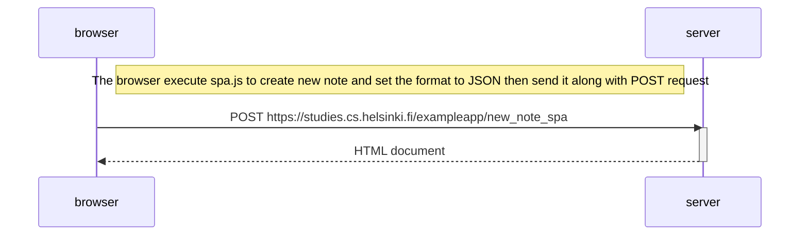

```mermaid
sequenceDiagram
    participant browser
    participant server

    Note right of browser: The browser execute spa.js to create new note and set the format to JSON then send it along with POST request

    browser->>server: POST https://studies.cs.helsinki.fi/exampleapp/new_note_spa
    activate server
    server-->>browser: HTML document
    deactivate server
```
